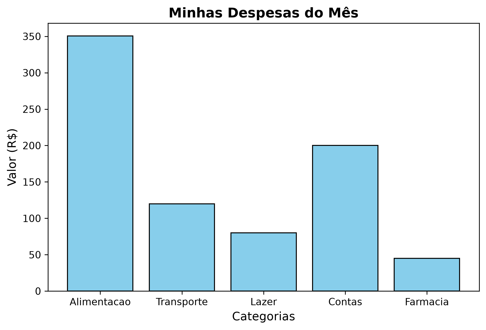

# analisador-de-despesas-python
Esse foi meu primeiro projeto em python. O script lê um arquivo em ".csv" de despesas e gera um gráfico com as categorias de gastos.
# O que foi usado
* Python
* Matplotlib
* Pandas
# Resultado

